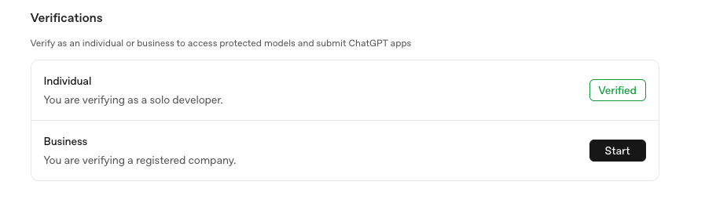

## Open AI Setup Instructions

1. Create an openai platform account here: [Sign up](https://auth.openai.com/create-account).  Note this is at: platform.openai.com.  It is not a typical ChatGPT account.

2. Create an API key.  Follow the "Create an API key in the Dashboard" [https://platform.openai.com/docs/libraries)](https://platform.openai.com/docs/libraries).

3. Some Open AI Image models require Verification before using them.  Follow the "Personal Verification" step at [https://platform.openai.com/settings/organization/general](https://platform.openai.com/settings/organization/general).

